<div align="center">
   <a href="https://grok.x.ai"></a>
  <h1>path</h1>
  <p>come home before it's too late</p>
  <p>helping people find their way home through media exploration</p>
  <p>
     <a href="https://github.com/bniladridas/path/actions/workflows/python-app.yml"></a>
     <a href="https://github.com/bniladridas/path/stargazers"></a>
     <a href="https://github.com/bniladridas/path/network/members"></a>
     <a href="https://github.com/bniladridas/path/issues"></a>
     <a href="https://github.com/bniladridas/path/blob/main/LICENSE"></a>
  </p>
</div>

## project structure

```mermaid
%%{init: {'theme': 'base', 'themeVariables': { 'fontSize': '12px' }}}%%
graph TD
    %% Root Directory
    root["path/"]

    %% .github Directory
    github[".github/"]
    github_workflows["workflows/"]
    github_codeql_yml["codeql.yml"]
    github_pylint_yml["pylint.yml"]
    github_python_app_yml["python-app.yml"]
    github_codeql_queries["codeql-queries/"]
    github_js_queries["javascript/"]
    github_js_dom_sec["dom-security.ql"]
    github_py_queries["python/"]
    github_py_flask_sec["flask-security.ql"]
    github_security_md["SECURITY.md"]
    github_codeql_config["codeql-config.yml"]
    github_dependabot_yml["dependabot.yml"]

    %% Templates Directory
    templates["templates/"]
    templates_index["index.html"]
    templates_terms["terms.html"]
    templates_privacy["privacy.html"]
    templates_updates["updates.html"]
    templates_verify["verify.html"]

    %% Static Directory
    static["static/"]
    static_css["css/"]
    static_css_style["style.css"]
    static_images["images/"]
    static_images_favicon["favicon.svg"]
    static_images_logo["logo.svg"]
    static_images_og["og.png"]
    static_images_verification["verification.png"]
    static_images_grok["grok/"]
    static_images_grok_img1["e6fb4338-88cc-4dd7-8a45-d4f2a6708084.jpg"]
    static_images_grok_img2["image.jpg"]

    %% Tests Directory
    tests["tests/"]
    tests_test_app["test_app.py"]

    %% Root Files
    app_py["app.py"]
    vercel_json["vercel.json"]
    requirements_txt["requirements.txt"]
    gitignore[".gitignore"]
    env_example[".env.example"]
    code_of_conduct["CODE_OF_CONDUCT.md"]
    license["LICENSE"]
    readme["README.md"]
    software_philosophy["SOFTWARE_PHILOSOPHY.txt"]

    %% .github Structure
    root --> github
    github --> github_workflows
    github_workflows --> github_codeql_yml
    github_workflows --> github_pylint_yml
    github_workflows --> github_python_app_yml
    github --> github_codeql_queries
    github_codeql_queries --> github_js_queries
    github_js_queries --> github_js_dom_sec
    github_codeql_queries --> github_py_queries
    github_py_queries --> github_py_flask_sec
    github --> github_security_md
    github --> github_codeql_config
    github --> github_dependabot_yml

    %% Main Structure
    root --> app_py
    root --> templates
    root --> static
    root --> tests
    root --> vercel_json
    root --> requirements_txt
    root --> gitignore
    root --> env_example
    root --> code_of_conduct
    root --> license
    root --> readme
    root --> software_philosophy

    %% Templates Structure
    templates --> templates_index
    templates --> templates_terms
    templates --> templates_privacy
    templates --> templates_updates
    templates --> templates_verify

    %% Static Structure
    static --> static_css
    static_css --> static_css_style
    static --> static_images
    static_images --> static_images_favicon
    static_images --> static_images_logo
    static_images --> static_images_og
    static_images --> static_images_verification
    static_images --> static_images_grok
    static_images_grok --> static_images_grok_img1
    static_images_grok --> static_images_grok_img2

    %% Tests Structure
    tests --> tests_test_app

    %% Styling
    classDef file fill:#f9f,stroke:#333,stroke-width:2px
    classDef dir fill:#bbf,stroke:#333,stroke-width:2px
    classDef config fill:#ff9,stroke:#333,stroke-width:2px

    %% Apply Classes
    class app_py,vercel_json,requirements_txt,gitignore,env_example,code_of_conduct,license,readme,software_philosophy file
    class github,templates,static,static_css,static_images,static_images_grok,tests dir
    class github_workflows,github_codeql_queries,github_js_queries,github_py_queries dir
    class github_codeql_yml,github_pylint_yml,github_python_app_yml,github_security_md,github_codeql_config,github_dependabot_yml,github_js_dom_sec,github_py_flask_sec config
    class templates_index,templates_terms,templates_privacy,templates_updates,templates_verify file
    class static_css_style,static_images_favicon,static_images_logo,static_images_og,static_images_verification,static_images_grok_img1,static_images_grok_img2 file
    class tests_test_app file
```



## a different kind of ai

path is an ai-powered media exploration interface that helps you discover movies, music, books, and games with radical transparency and human dignity. powered by google's gemini 1.5 flash, path exists to help people find their way back to themselves through authentic media discovery.

## four pillars of authentic discovery

- **authentic discovery**: no manipulation, just honest responses that honor your curiosity
- **human longing**: recognizing the deeper needs behind every search for meaning
- **time is precious**: cutting through noise to help you find what truly matters
- **coming home**: helping you find your way back to yourself through media

## features that serve human flourishing

- **radical transparency**: complete visibility into ai costs, data usage, and system operations
- **privacy by design**: no conversation history stored, fresh interactions every time
- **theme customization**: 5 beautiful color themes that adapt the entire interface
- **keyboard shortcuts**: efficient navigation with single-key access to all tools
- **comprehensive tools**: about, product, token pricing, protocol details, gmail integration, neural networks explanation, blog, and developer resources
- **human verification**: thoughtful protection against automated access
- **legal transparency**: complete terms of use, privacy policy, and updates tracking
- **responsive design**: beautiful on desktop and mobile devices

## getting started

### what you need
- python 3.8 or later
- a [google gemini api](https://ai.google.dev/) key

### local development
1. clone the repository:
   ```bash
   git clone https://github.com/bniladridas/path.git
   cd path
   ```
2. create and activate a virtual environment (recommended):
   ```bash
   python3 -m venv venv
   source venv/bin/activate
   ```
3. install dependencies:
   ```bash
   pip install -r requirements.txt
   ```
4. add your api key to a `.env` file:
   ```
   GEMINI_API_KEY=your-gemini-api-key
   ```
5. launch the app:
   ```bash
   python app.py
   ```
6. visit `http://127.0.0.1:8000` in your browser

## deployment

### vercel deployment (recommended)
1. install vercel cli:
   ```bash
   npm install -g vercel
   ```
2. log in to vercel:
   ```bash
   vercel login
   ```
3. deploy to preview:
   ```bash
   vercel
   ```
4. set your environment variable:
   ```bash
   vercel env add GEMINI_API_KEY
   ```
5. deploy to production:
   ```bash
   vercel --prod
   ```

path is optimized for vercel's serverless platform with automatic scaling and global edge deployment.

## how path works

### user experience
- first-time visitors complete human verification (or use gmail for automatic bypass)
- enter media queries and press enter (or press `/` to focus search)
- google gemini 1.5 flash processes requests with path's specialized prompt
- responses appear below the search bar in a clean, readable format
- access tools via three-dot menu or keyboard shortcuts (a, r, h, p, t, o, g, n, b, c)
- switch themes instantly with number keys (1-5) or via menu
- all interactions are private - no conversation history stored

### keyboard shortcuts
- **/** - focus search input
- **escape** - close modals and return to home
- **a** - about path
- **r** - reset interface
- **h** - help and usage guide
- **p** - product philosophy (four pillars)
- **t** - token pricing transparency
- **o** - protocol and connection details
- **g** - gmail integration benefits
- **n** - neural networks explanation
- **b** - blog (why path exists)
- **c** - coders (developer inspection guide)
- **1-5** - theme selection (908b70, 4e4c40, a9844f, d5c9bc, 141614)

### human verification
the verification system shows an image requiring description. for development, use `/bypass-verification` to skip this step. gmail users receive automatic verification bypass for streamlined access.


## ux philosophy & prompt methodology

### interface design principles

#### minimalist interaction
- **single search input**: one text field, infinite possibilities
- **progressive disclosure**: tools appear when needed, hidden when not
- **keyboard-first**: every action accessible via shortcuts
- **visual hierarchy**: content first, chrome second

#### emotional design
- **curiosity-driven**: interface encourages exploration
- **learning-oriented**: errors become opportunities to discover
- **human warmth**: technology that feels approachable, not intimidating
- **coming home**: familiar patterns that feel safe and welcoming

### prompt engineering methodology

#### ai personality design
```
"path" - an AI assistant who helps people find their way home through media exploration
```

#### core prompt architecture
- **identity establishment**: clear name and purpose ("path")
- **privacy transparency**: explicit mention of no conversation history
- **enthusiasm modeling**: genuine curiosity and excitement about discovery
- **boundary setting**: media-focused scope with gentle redirects
- **response constraints**: 2-3 sentences maximum for focused interactions

#### conversation flow design
- **fresh context**: each interaction starts completely clean
- **no memory burden**: users don't need to repeat context
- **immediate value**: every response provides actionable insights
- **natural language**: conversational tone, not robotic responses

#### error handling philosophy
- **maintain curiosity**: errors don't break the learning mindset
- **honest communication**: transparent about what went wrong
- **encouraging tone**: setbacks become part of the exploration journey
- **system resilience**: graceful degradation maintains user confidence

### user experience patterns

#### discovery workflow
1. **arrival**: clean interface invites exploration
2. **verification**: human-friendly process with gmail bypass
3. **exploration**: search reveals path's personality and capabilities
4. **tool discovery**: three-dot menu reveals deeper functionality
5. **customization**: themes allow personal expression
6. **mastery**: keyboard shortcuts enable power user efficiency

#### information architecture
- **search-centric**: primary interaction model
- **tool constellation**: related functions grouped logically
- **theme system**: visual customization without complexity
- **transparency layers**: increasing detail available on demand

## technical philosophy

### privacy by design
- no conversation history stored or accessed
- fresh ai interactions every time
- minimal data collection with transparent policies
- gmail domain verification only (no email storage)

### radical transparency
- complete token pricing visibility
- open source codebase for inspection
- detailed protocol and connection information
- honest error handling with learning-oriented messages

### human-centered technology
- keyboard shortcuts for efficiency
- responsive design for all devices
- thoughtful error messages that maintain curiosity
- clean interface that puts content first

## license

open and free under the [mit license](LICENSE).

## built with love and

- [google gemini 1.5 flash](https://ai.google.dev/) - ai processing
- [flask](https://flask.palletsprojects.com/) - web framework
- [vercel](https://vercel.com/) - deployment platform
- vanilla javascript - no frameworks, just honest code
- css custom properties - theme system
- human curiosity and the desire to come home

---

*path exists to help people find their way home through media exploration. every line of code reflects our commitment to honest technology that serves human flourishing rather than corporate metrics.*
